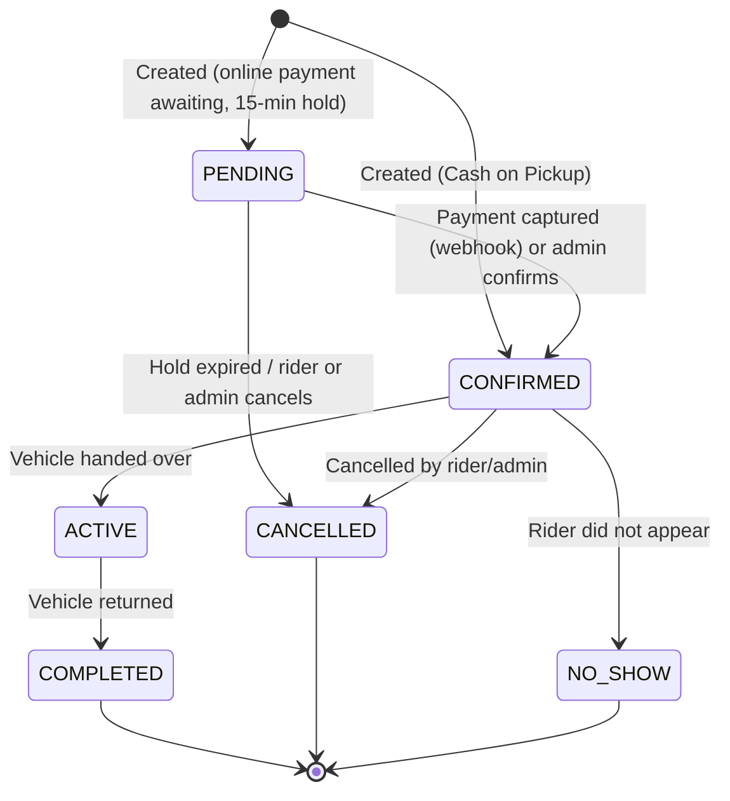
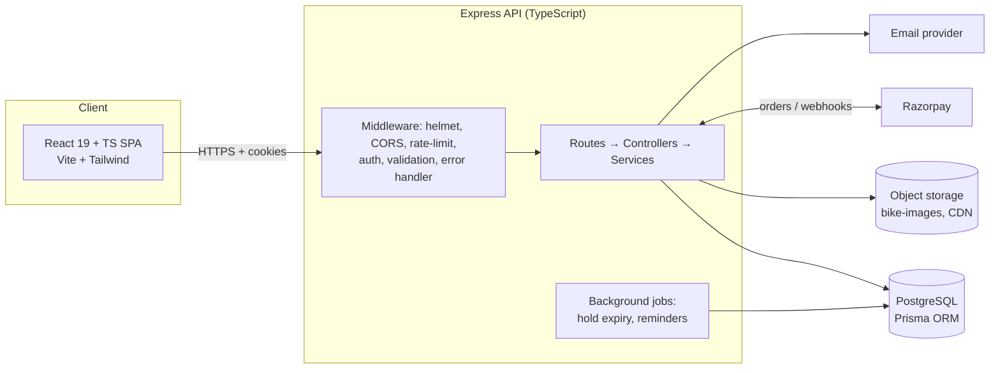
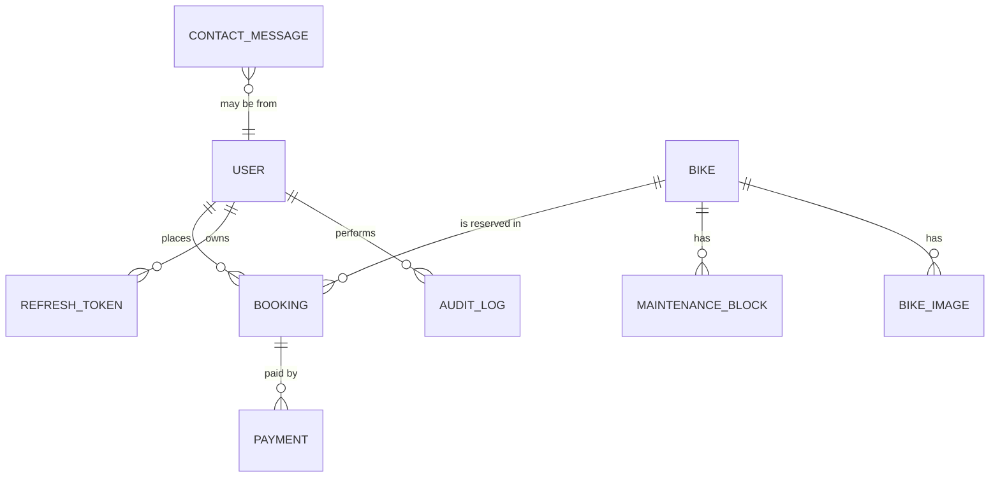
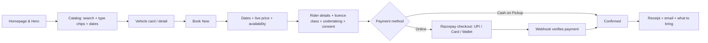
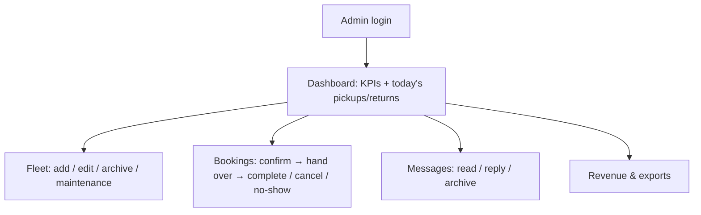

# 🚴 RideEasy — Product Requirements Document

| | |
| :--- | :--- |
| **Product** | RideEasy — On-Demand Bike & Scooter Rental Platform |
| **Document version** | 2.0 (restructured and research-backed rewrite of v1) |
| **Date** | 8 October 2026 |
| **Status** | In active development: prototype → full MVP |
| **Primary market** | Goa, India (design stays portable to other regions) |
| **Stack** | React 19 + TypeScript (Vite, Tailwind) · Node.js + Express · Prisma · PostgreSQL |

---

## Table of Contents

1. [Executive Summary](#1-executive-summary)
2. [Problem, Goals & Success Metrics](#2-problem-goals--success-metrics)
3. [Market & Regulatory Research](#3-market--regulatory-research)
4. [Users & Personas](#4-users--personas)
5. [Scope](#5-scope)
6. [Current State vs Target State (Gap Analysis)](#6-current-state-vs-target-state-gap-analysis)
7. [Functional Requirements](#7-functional-requirements)
8. [Core Business Rules](#8-core-business-rules)
9. [System Architecture](#9-system-architecture)
10. [Data Model](#10-data-model)
11. [API Specification](#11-api-specification)
12. [Security Requirements](#12-security-requirements)
13. [Non-Functional Requirements](#13-non-functional-requirements)
14. [UX Requirements](#14-ux-requirements)
15. [Testing & Quality Strategy](#15-testing--quality-strategy)
16. [Delivery Plan & Milestones](#16-delivery-plan--milestones)
17. [Risks & Mitigations](#17-risks--mitigations)
18. [Open Questions](#18-open-questions)
19. [Future Roadmap (Post-MVP)](#19-future-roadmap-post-mvp)
20. [Appendix A: Changes from PRD v1](#appendix-a-changes-from-prd-v1)
21. [Appendix B: Glossary](#appendix-b-glossary)
22. [Appendix C: Sources](#appendix-c-sources)

---

## 1. Executive Summary

RideEasy is an end-to-end rental platform that connects **riders** who want flexible local mobility with a **fleet operator** who needs control over inventory, reservations, payments, customer messages and revenue.

The v1 prototype proved the stack: a React front end listing bikes from an Express + Prisma API, plus a `POST /api/bookings` endpoint. It is missing nearly everything needed to run a real rental business: authentication, availability checks, payments, an admin portal, and compliance handling.

This document:

- Keeps the original vision and feature list.
- Fixes design problems in v1 that would cause bugs or security holes in production (see [Appendix A](#appendix-a-changes-from-prd-v1)).
- Adds the requirements that research showed a real rental product needs: **double-booking prevention, server-side pricing, UPI/online payments with verified webhooks, rider document capture, and compliance with Goa's rent-a-bike rules and India's data protection law**.

### One-line positioning

> A fast, India-ready rental platform for small fleet operators: simple for riders to book, safe and compliant for operators to run.

---

## 2. Problem, Goals & Success Metrics

### 2.1 Problem statement

| Stakeholder | Pain today |
| :--- | :--- |
| **Riders / tourists** | Hard to compare vehicles and prices, uncertainty about availability, pay-in-cash-and-hope experiences, unclear paperwork and deposit rules. |
| **Fleet operators** | Bookings handled by phone/WhatsApp/notebooks, double-booked vehicles, no maintenance visibility, no revenue view, manual ID and undertaking paperwork. |

### 2.2 Product goals

| # | Goal | Maps to |
| :-- | :--- | :--- |
| G1 | **Frictionless rider booking:** discover, filter, reserve and pay in under 3 minutes. | Rider flows |
| G2 | **Operational control for the fleet owner:** inventory, maintenance, reservations, messages and revenue in one admin portal. | Admin portal |
| G3 | **Correctness:** a vehicle can never be double-booked and a price can never be tampered with. | Business rules, DB constraints |
| G4 | **Compliance-ready:** support the documents, consents and records that local rental rules and data protection law expect. | Compliance |
| G5 | **Modern, maintainable foundation:** typed end to end, containerised, tested, CI-gated. | Architecture |

### 2.3 Success metrics (targets for first 90 days after launch)

| Metric | Target |
| :--- | :--- |
| Booking funnel conversion (catalog view → paid/confirmed booking) | ≥ 4% |
| Median time from "Book Now" to confirmation | ≤ 3 minutes |
| Double-booking incidents | **0** (enforced by database) |
| Payment success rate (attempted → captured) | ≥ 90% |
| Lighthouse mobile performance score (catalog page) | ≥ 85 |
| P95 API latency (read endpoints) | ≤ 300 ms |
| Admin time to confirm a booking | ≤ 2 clicks |
| Contact messages answered within 24 h | ≥ 90% |

---

## 3. Market & Regulatory Research

> ⚠️ This section summarises public information gathered in October 2026 to inform requirements. It is **not legal advice**. Rental rules in Goa have changed repeatedly; verify current rules with the Goa Transport Department and a local lawyer before launch.

### 3.1 Competitive landscape

| Category | Examples | What they do well | Gap RideEasy can fill |
| :--- | :--- | :--- | :--- |
| **General rental SaaS** | Booqable (reports 8,000+ rental businesses), Rentle | Availability that updates automatically, website builders, mobile apps | Generic equipment focus; not tuned for Indian payments or local paperwork |
| **Bike-specific SaaS** | bike.rent Manager, Booking YoYo | Multi-location, maintenance management, rental durations, booking-conflict avoidance | Priced and designed for larger/Western operators |
| **Marketplaces** | BikesBooking.com | Price comparison and reviews across operators; extras such as helmets, delivery, insurance | Operator pays marketplace margin; no ownership of the customer relationship |
| **Local operators** | WhatsApp / phone / walk-in | Zero setup cost | No availability truth, no payments, no records |

**Takeaways for the product**

1. Automatic availability and conflict prevention is the *core* promise of every serious competitor. It must be a day-one feature, not polish.
2. Maintenance tracking and "extras" (helmets, delivery, insurance, deposit) are table stakes in bike-specific tools.
3. The differentiator for RideEasy is **India-first operations**: UPI, cash-on-pickup, Aadhaar/driving-licence capture, and compliance prompts.

### 3.2 Goa rent-a-bike context (primary market)

| Finding (from public reporting) | Product implication |
| :--- | :--- |
| Rented two-wheelers must be commercial **yellow-plate** vehicles; renting out private (white-plate) bikes to tourists is illegal and can lead to penalties, impounding and licence suspension for the owner. | Admin must record **registration number and plate type** per vehicle; platform terms must forbid listing private vehicles. |
| Transport authorities have said operators must supply **ISI-marked helmets**; this has been announced/proposed as a permit condition. | Every booking includes helmet(s) by default; fleet record carries a helmet-compliance flag; rider terms mention ISI helmets. |
| Goa Police require renters to sign an **undertaking** to follow traffic rules before using rented cars/bikes. | Booking flow includes an **undertaking acceptance** step, timestamped and stored. |
| Operators have been asked to record renters' **Aadhaar and driving licence** details. | Capture licence details (see 7.3) with explicit consent and strict access control. |
| Permit issuance has been tightened sharply: 1,277 (2022), 1,911 (2023), 444 (2024), 209 (2025), and officials have said they will not clear new licences in some periods. | Supply of legal operators is shrinking, which is good for incumbents. RideEasy should target *existing* licensed operators and never imply it can help obtain permits. |
| Over 27,000 traffic violations involving rented cars/bikes were booked between Jan 2024 and Feb 2025, most by tourists; some roads (e.g. Atal Setu) ban two-wheelers entirely. | Show **safety rules, restricted roads and local traffic rules** during checkout and in the confirmation message. |
| Licence class matters (e.g. scooters above ~125 cc need a full motorcycle licence in many rental markets). | Each vehicle has an **engine capacity (cc)** and a **required licence class**; booking asks the rider to confirm they hold it. |
| Typical pricing signals: roughly ₹500/day for a scooter up to ₹2,500/day for a premium cruiser. | Use these as seed-data and validation ranges (warn the admin if a price is far outside). |

### 3.3 Data protection (India)

- The **Digital Personal Data Protection (DPDP) Rules, 2025** were notified in November 2025. Core obligations are phased in, with full compliance expected around **mid-May 2027**; business size does not exempt a company.
- Consent must be **specific, informed, unambiguous, tied to a purpose, and as easy to withdraw as to give**. Indefinite retention is discouraged; breaches must be reported.
- RideEasy will store sensitive rider data (driving licence, ID details, phone, email). Therefore:
  - Collect only what is needed (data minimisation).
  - Show a clear notice and capture **consent with timestamp and version**.
  - Provide **withdrawal and deletion** paths (subject to legally required retention).
  - Encrypt sensitive fields; restrict admin access; log access.

### 3.4 Payments (India)

- Indian riders expect **UPI** first, then cards, wallets and cash. Gateways such as Razorpay support UPI (intent, collect, QR), cards, netbanking and wallets.
- Industry practice: **never trust the browser redirect** to mark an order paid. Create an order server-side, then confirm via a **server-to-server webhook** whose **HMAC-SHA256 signature is verified**. Relevant events include payment captured, payment failed and refund processed.
- Decision: use **Razorpay** (UPI-first) behind a `PaymentProvider` interface, so another gateway can be swapped in. Cash on Pickup remains an offline method.

### 3.5 Technical research conclusions

| Topic | Finding | Decision |
| :--- | :--- | :--- |
| **Double booking** | A "check, then insert" application query has a race condition: two concurrent requests can both pass the check. A PostgreSQL **exclusion constraint** on a time range (GiST, `&&` overlap, scoped per vehicle and partial on active statuses) makes the database reject overlaps. Prisma cannot model exclusion constraints in `schema.prisma`, so the constraint is added as raw SQL in a migration. PostgreSQL 18 also offers `WITHOUT OVERLAPS` temporal constraints. | Use an exclusion constraint (raw SQL migration) and translate error `23P01` into a friendly `409 Conflict`. |
| **Auth tokens** | Current guidance: short-lived access tokens (~15 min), tokens in **HttpOnly + Secure + SameSite** cookies (not `localStorage`), **refresh-token rotation** with hashed storage and reuse detection, CSRF protection when cookies are used, rate limiting on auth routes. | Adopt this pattern instead of storing a JWT in browser storage. |
| **Image upload** | Client-supplied MIME type and extension can be spoofed. | Validate by **file signature (magic bytes)**, enforce size limit, re-encode/strip metadata, store in object storage, serve via CDN. |

---

## 4. Users & Personas

| Persona | Description | Key needs |
| :--- | :--- | :--- |
| **Aarav, the tourist rider** | 20s–30s, visiting for 3–10 days, books on phone, pays by UPI | See real availability, pick a scooter fast, clear total price, know what documents to bring |
| **Maria, the local commuter** | Rents for a week or month while her own vehicle is repaired | Longer-duration discounts, repeat-booking history |
| **Rohan, the fleet owner / admin** | Runs 20–200 vehicles, manages on a laptop and phone | One screen showing today's pickups/returns, quick status changes, revenue, maintenance alerts |
| **Staff member (v1.1)** | Counter staff handing over keys | Limited role: confirm pickup/return, cannot edit prices or delete vehicles |

Roles at launch: `CUSTOMER`, `ADMIN`. Reserved for later: `STAFF`.

---

## 5. Scope

### 5.1 In scope (MVP)

- Public catalog with search and type filters
- Vehicle detail pages
- Booking with date selection, availability check, server-side price, payment choice
- Online payment (Razorpay: UPI/cards/wallets) and Cash on Pickup
- Customer accounts (register/login) **and** guest checkout
- Contact form
- Admin portal: dashboard, fleet CRUD, booking management, message inbox, image upload
- Email notifications (booking confirmation, status changes)
- Rider undertaking and document capture
- Responsive, accessible UI

### 5.2 Out of scope (MVP)

- Hourly rentals and dynamic pricing (see roadmap)
- Native mobile app, GPS/IoT tracking
- Multi-operator marketplace
- Insurance underwriting, damage-claim workflow (manual in MVP)
- Multi-language UI (English only; structure for i18n)

### 5.3 Assumptions

- Single operator, single time zone (`Asia/Kolkata`), single currency (INR).
- Pricing is **per calendar day**; pickup time is informational.
- The operator holds valid permits; RideEasy is a software tool, not a licensing authority.

---

## 6. Current State vs Target State (Gap Analysis)

Legend: ✅ Done · 🟡 Partial · 🔴 Not started

### 6.1 Rider-facing

| ID | Feature | Status | Today | Target |
| :-- | :--- | :-: | :--- | :--- |
| R1 | Homepage & hero | 🟡 | Headline + subtitle in `App.tsx` | CTAs (Browse Fleet, How It Works), trust stats, feature cards, responsive nav |
| R2 | Browse bikes | 🟡 | Grid of all bikes | Server-side pagination, availability badge, sort by price |
| R3 | Filter by type | 🔴 | None | Chips: All / Mountain / Road / Electric / Scooter via `?type=` |
| R4 | Search by name | 🔴 | None | Debounced (300 ms) search of name and description via `?search=` |
| R5 | Booking | 🟡 | Static "Book Now" buttons; `POST /api/bookings` exists | Booking modal/page, availability check, server-computed total, confirmation |
| R6 | Payments | 🔴 | `paymentMethod` string only | Razorpay (UPI/cards/wallets), Cash on Pickup, payment status |
| R7 | Responsive design | 🟡 | Tailwind grid | Mobile drawer nav, sticky booking summary, 44 px touch targets |
| R8 | Contact form | 🔴 | None | Form + `/api/contact` + `ContactMessage` model |
| R9 | Accounts | 🔴 | `User` model only | Register / login / profile / my bookings |
| R10 | Undertaking & documents | 🔴 | None | Acceptance step, licence details capture |

### 6.2 Admin-facing

| ID | Feature | Status | Today | Target |
| :-- | :--- | :-: | :--- | :--- |
| A1 | Secure login | 🔴 | Role field only | Cookie-based JWT auth, bcrypt, role guard |
| A2 | Dashboard | 🔴 | None | KPIs: total bikes, active bookings, in maintenance, revenue, unread messages, today's pickups/returns |
| A3 | Vehicle CRUD | 🔴 | Read-only GET | Create / edit / archive with validation and status control |
| A4 | Booking management | 🔴 | Create only | List, filter, detail, status transitions, payment status update |
| A5 | Contact inbox | 🔴 | None | List, filter, mark read / resolved / archived |
| A6 | Image upload | 🔴 | URL strings only | Validated upload to object storage; CDN URL stored |
| A7 | Maintenance log | 🔴 | None | Record service events; set vehicle to MAINTENANCE with a date range |

---

## 7. Functional Requirements

Priority key: **P0** must ship in MVP · **P1** should ship · **P2** nice to have.

### 7.1 Catalog, search & filtering

| ID | Requirement | Priority |
| :-- | :--- | :-: |
| FR-CAT-1 | `GET /api/bikes` returns bikes with optional `type`, `search`, `status`, `page`, `limit`, `sort`, and optional `startDate`/`endDate` to show availability for those dates. | P0 |
| FR-CAT-2 | Type filter chips: All, Mountain, Road, Electric, Scooter. "All" clears the filter. | P0 |
| FR-CAT-3 | Search matches `name` and `description`, case-insensitive, debounced 300 ms, and shows a clear empty state. | P0 |
| FR-CAT-4 | Filter and search state is reflected in the URL query string (shareable, back-button friendly). | P1 |
| FR-CAT-5 | Each card shows image, name, type, price/day, engine cc (if motorised), and availability badge. | P0 |
| FR-CAT-6 | Vehicle detail page: gallery, specs, included items (helmet), deposit, licence class required, price, availability calendar. | P1 |
| FR-CAT-7 | Archived and maintenance vehicles never appear as bookable. | P0 |

**Acceptance criteria**
- Selecting "Electric" shows only bikes where `type = ELECTRIC`; selecting "All" removes the filter.
- Typing "act" shows bikes whose name or description contains "act" within 400 ms of the last keystroke.
- Providing dates hides (or marks unavailable) bikes with overlapping active bookings.

### 7.2 Booking

| ID | Requirement | Priority |
| :-- | :--- | :-: |
| FR-BKG-1 | Booking modal collects start date, end date, payment method, contact details (guests) and undertaking acceptance. | P0 |
| FR-BKG-2 | The UI shows computed days and total **for preview only**; the server recomputes and is the source of truth. | P0 |
| FR-BKG-3 | `POST /api/bookings` rejects: start in the past, end before start, days < 1, unavailable vehicle, archived/maintenance vehicle. | P0 |
| FR-BKG-4 | The server ignores any client-supplied `days`, `totalAmount` or `userId`; it derives them from the request and the session. | P0 |
| FR-BKG-5 | Overlapping bookings are impossible (database exclusion constraint); conflicts return `409 SLOT_UNAVAILABLE`. | P0 |
| FR-BKG-6 | After creation the rider sees a confirmation receipt with a human-readable booking reference (e.g. `RE-2026-000123`) and receives an email. | P0 |
| FR-BKG-7 | Online-payment bookings start as `PENDING` with a **15-minute hold**; if unpaid after the hold, a background job cancels them and releases the vehicle. | P0 |
| FR-BKG-8 | Riders can view their bookings and cancel according to the cancellation policy (see 8.4). | P1 |
| FR-BKG-9 | Optional extras (second helmet, phone holder, delivery) priced per booking or per day. | P2 |

**Date validation (all must hold)**
- `startDate ≥ today` (in `Asia/Kolkata`).
- `endDate ≥ startDate`.
- `days = (endDate − startDate) + 1 ≥ 1` (inclusive day counting; see 8.1).
- `totalAmount = days × pricePerDay` (+ extras, − discounts), computed server-side in integer paise.

### 7.3 Rider identity, undertaking & consent

| ID | Requirement | Priority |
| :-- | :--- | :-: |
| FR-KYC-1 | At booking, collect: full name, phone, email, driving licence number and licence class. | P0 |
| FR-KYC-2 | Show an **undertaking** (obey traffic laws, ISI helmet, restricted roads, no pillion overload, liability terms). Rider must tick to accept; store text version and timestamp. | P0 |
| FR-KYC-3 | Collect consent for processing personal data, with purpose and a link to the privacy notice; record `consentVersion` and `consentedAt`. | P0 |
| FR-KYC-4 | Aadhaar/ID: if the operator needs an ID deposit, record only **type and last 4 digits** and note "original/copy held at counter". Do not store full Aadhaar numbers in the database. | P0 |
| FR-KYC-5 | Optional upload of licence photo (P2) stored privately (signed URLs, admin-only, auto-deleted after retention window). | P2 |
| FR-KYC-6 | Provide a self-service **data deletion / withdrawal request** path (creates an admin task; honoured subject to legal retention). | P1 |

### 7.4 Payments

| ID | Requirement | Priority |
| :-- | :--- | :-: |
| FR-PAY-1 | Methods: **Online (UPI / Card / Wallet via Razorpay)** and **Cash on Pickup**. | P0 |
| FR-PAY-2 | Payment status enum: `UNPAID`, `PENDING`, `PAID`, `FAILED`, `REFUNDED`, `PARTIALLY_REFUNDED`. | P0 |
| FR-PAY-3 | Online flow: server creates a gateway order → client opens checkout → gateway calls our **webhook** → server verifies the HMAC-SHA256 signature → marks `PAID` and confirms the booking. The browser callback is never trusted. | P0 |
| FR-PAY-4 | Webhooks are **idempotent** (dedupe on gateway event id) and safe to receive out of order. | P0 |
| FR-PAY-5 | Cash on Pickup bookings are `CONFIRMED` immediately but `UNPAID` until the admin marks payment received at pickup. | P0 |
| FR-PAY-6 | Admin can issue a full or partial refund through the gateway when a booking is cancelled (policy-driven). | P1 |
| FR-PAY-7 | Refundable **security deposit** (amount per vehicle) shown at checkout; recorded as a separate ledger line. | P1 |
| FR-PAY-8 | Secrets (gateway key/secret, webhook secret) live in environment variables and never reach the client. | P0 |

### 7.5 Contact

| ID | Requirement | Priority |
| :-- | :--- | :-: |
| FR-CON-1 | Contact form: name (≤100), email (valid format, ≤100), subject (optional, ≤150), message (required, ≤2000). | P0 |
| FR-CON-2 | `POST /api/contact` validates input, stores with status `UNREAD`, and sends the admin a notification email. | P0 |
| FR-CON-3 | Spam protection: rate limit per IP + honeypot field (CAPTCHA is P2). | P0 |
| FR-CON-4 | Admin inbox with status badges `UNREAD`, `READ`, `REPLIED`, `ARCHIVED`; "Reply" opens the admin's mail client with a prefilled `mailto:`. | P0 |

### 7.6 Authentication & accounts

| ID | Requirement | Priority |
| :-- | :--- | :-: |
| FR-AUTH-1 | `POST /api/auth/register` (name, email, phone, password) with email uniqueness and password policy (min 10 chars, checked against common-password list). | P0 |
| FR-AUTH-2 | `POST /api/auth/login` issues a short-lived access JWT (15 min) and a rotating refresh token (7–30 days) in **HttpOnly, Secure, SameSite** cookies. | P0 |
| FR-AUTH-3 | `POST /api/auth/refresh` rotates the refresh token (old one invalidated; reuse of an old token revokes the whole token family). | P0 |
| FR-AUTH-4 | `POST /api/auth/logout` revokes the refresh token and clears cookies. | P0 |
| FR-AUTH-5 | Passwords hashed with bcrypt (cost ≥ 12) or argon2id. Never logged, never returned. | P0 |
| FR-AUTH-6 | Role-based guards: `/api/admin/*` requires `ADMIN`. Missing/invalid token → `401`; wrong role → `403`. | P0 |
| FR-AUTH-7 | Login rate limiting and temporary lockout after repeated failures. | P0 |
| FR-AUTH-8 | Password reset via emailed one-time link (expires in 30 min). | P1 |
| FR-AUTH-9 | The first admin is created by a **seed script / CLI** using environment variables, never through public registration. | P0 |

### 7.7 Admin portal

| ID | Requirement | Priority |
| :-- | :--- | :-: |
| FR-ADM-1 | **Dashboard** KPIs: total vehicles, available now, active rentals, in maintenance, revenue (today / 7 days / month), pending bookings, unread messages; list of today's pickups and returns. | P0 |
| FR-ADM-2 | **Fleet:** create, edit, archive (soft-delete), restore. Fields: name, type, description, price/day, engine cc, registration number, plate type, helmet included, deposit, licence class, image(s), status. | P0 |
| FR-ADM-3 | **Archive rather than delete** a vehicle that has bookings (preserve history). Hard delete only for vehicles with zero bookings. | P0 |
| FR-ADM-4 | **Bookings:** table with filters (status, date range, vehicle, payment status) and search by reference/name/phone; booking detail drawer. | P0 |
| FR-ADM-5 | **Status transitions** via one-click actions that enforce the state machine (see 8.2). Invalid transitions are rejected with `409`. | P0 |
| FR-ADM-6 | **Messages:** inbox list, detail view, change status. | P0 |
| FR-ADM-7 | **Image upload** with preview, drag-and-drop, and replace. Accepts `.jpg`, `.png`, `.webp`; max 5 MB; validated by magic bytes. | P0 |
| FR-ADM-8 | **Maintenance log:** record service date, description, cost, and block the vehicle for a date range. | P1 |
| FR-ADM-9 | **Audit log** of admin actions (who changed what and when). | P1 |
| FR-ADM-10 | CSV export of bookings and revenue for accounting. | P1 |

---

## 8. Core Business Rules

### 8.1 Pricing & date counting

- Currency: **INR**, stored as **integer paise** (`₹799.00 = 79900`) to avoid floating-point errors.
- Day counting is **inclusive of both start and end dates**: a booking from 10 Oct to 10 Oct is 1 day; 10 Oct to 12 Oct is 3 days.
- `subtotal = days × pricePerDayAtBooking`. The price is **snapshotted** on the booking so later price changes don't alter existing bookings.
- Optional later: weekly/monthly discounts (e.g. 7+ days = 10% off) and GST line items if the operator is GST-registered.

### 8.2 Booking state machine



Only the transitions above are allowed. `PENDING`, `CONFIRMED` and `ACTIVE` bookings **block** the vehicle's calendar; `COMPLETED`, `CANCELLED` and `NO_SHOW` free it.

### 8.3 Vehicle availability and status (changed from v1)

v1 proposed flipping `bike.status` to `RENTED` when a booking is confirmed. That breaks for **future-dated** reservations (a bike confirmed for next month would look rented today and could not be booked for any date in between).

**New model**

| Concept | How it works |
| :--- | :--- |
| `Bike.status` (operational state) | `AVAILABLE`, `MAINTENANCE`, `RETIRED` (archived). Set by the admin. |
| **Availability for dates** | Derived: bike is bookable for `[start, end]` if `status = AVAILABLE` **and** no blocking booking or maintenance block overlaps. |
| "Currently rented" | Derived: a bike with an `ACTIVE` booking today. Shown as a live badge and in dashboard counts. |
| Maintenance block | `MaintenanceBlock(bikeId, startDate, endDate)` participates in the same overlap protection. |

This still satisfies the v1 intent ("when a rental completes or is cancelled the bike is available again") without data going stale.

### 8.4 Cancellation & refund policy (configurable defaults)

| When cancelled | Refund |
| :--- | :--- |
| More than 24 h before start | 100% of rental amount |
| Within 24 h of start | 50% |
| After start / no-show | 0% |
| By operator (vehicle unavailable) | 100% + apology credit (optional) |

Policy is stored in settings, displayed at checkout, and snapshotted on the booking.

### 8.5 Data retention

| Data | Retention |
| :--- | :--- |
| Booking and payment records | 7 years (tax/accounting) |
| Rider identity details (licence number, ID last-4) | Delete or anonymise 12 months after the booking ends, unless legally required |
| Contact messages | 24 months |
| Access/audit logs | Minimum 12 months |

(Confirm each period with legal counsel.)

---

## 9. System Architecture

### 9.1 High-level view



### 9.2 Technology decisions

| Concern | Choice | Rationale |
| :--- | :--- | :--- |
| Front end | React 19, TypeScript, Vite, Tailwind, React Router, TanStack Query | Typed, fast, good server-state caching |
| Forms & validation | React Hook Form + **Zod** (schemas shared with the API) | One source of truth for validation |
| API | Express + TypeScript, layered (routes / controllers / services / repositories) | Familiar, flexible |
| Validation | Zod on every request body/query/param | Prevent malformed and malicious input |
| ORM / DB | Prisma + PostgreSQL | Typed queries; migrations; raw SQL for the exclusion constraint |
| Auth | JWT access + rotating refresh token in HttpOnly cookies | See Section 12 |
| Storage | Supabase Storage **or** S3-compatible bucket (`bike-images`) with CDN | Choose **one**; Multer only used as a transient parser (memory storage), not for permanent disk storage |
| Payments | Razorpay behind a `PaymentProvider` interface | UPI-first; swappable |
| Email | Resend / SES / SMTP behind a `Mailer` interface | Swappable |
| Jobs | `node-cron` initially; BullMQ + Redis if scale demands | Hold expiry, reminders |
| Logging | `pino` with request IDs | Structured logs |
| Tests | Vitest (unit), Supertest + real Postgres (integration), Playwright (E2E) | See Section 15 |
| CI/CD | GitHub Actions: lint, typecheck, test, build, Docker image | Gate merges |
| Hosting | Docker containers; managed Postgres | Matches "container-ready" objective |

### 9.3 Suggested repository layout

```
rideeasy/
├─ backend/
│  ├─ prisma/
│  │  ├─ schema.prisma
│  │  └─ migrations/        # includes raw-SQL exclusion constraint
│  └─ src/
│     ├─ config/            # env parsing (Zod), constants
│     ├─ middleware/        # auth, rbac, validate, error, rateLimit
│     ├─ modules/
│     │  ├─ auth/  bikes/  bookings/  payments/  contact/  admin/  uploads/
│     │  └─ (each: routes, controller, service, schemas, tests)
│     ├─ jobs/              # holdExpiry, reminders
│     ├─ lib/               # prisma client, mailer, paymentProvider, storage
│     └─ server.ts
├─ frontend/
│  └─ src/
│     ├─ pages/  components/  features/  hooks/  lib/api/
├─ shared/                  # Zod schemas + TS types used by both
├─ docker-compose.yml
└─ .github/workflows/ci.yml
```

---

## 10. Data Model

### 10.1 Entity relationship overview



### 10.2 Prisma schema (target)

```prisma
generator client { provider = "prisma-client-js" }
datasource db   { provider = "postgresql"; url = env("DATABASE_URL") }

enum Role            { CUSTOMER ADMIN STAFF }
enum BikeType        { MOUNTAIN ROAD ELECTRIC SCOOTER }
enum BikeStatus      { AVAILABLE MAINTENANCE RETIRED }
enum BookingStatus   { PENDING CONFIRMED ACTIVE COMPLETED CANCELLED NO_SHOW }
enum PaymentMethod   { ONLINE CASH_ON_PICKUP }
enum PaymentStatus   { UNPAID PENDING PAID FAILED REFUNDED PARTIALLY_REFUNDED }
enum MessageStatus   { UNREAD READ REPLIED ARCHIVED }

model User {
  id           String   @id @default(uuid())
  name         String   @db.VarChar(100)
  email        String   @unique @db.VarChar(100)
  phone        String?  @db.VarChar(20)
  passwordHash String   @map("password_hash")
  role         Role     @default(CUSTOMER)
  createdAt    DateTime @default(now()) @map("created_at")
  bookings      Booking[]
  refreshTokens RefreshToken[]
  @@map("users")
}

model RefreshToken {
  id        String   @id @default(uuid())
  userId    String   @map("user_id")
  tokenHash String   @unique @map("token_hash")   // SHA-256 of the opaque token
  familyId  String   @map("family_id")            // for reuse detection
  expiresAt DateTime @map("expires_at")
  revokedAt DateTime? @map("revoked_at")
  user      User     @relation(fields: [userId], references: [id], onDelete: Cascade)
  @@index([userId])
  @@index([familyId])
  @@map("refresh_tokens")
}

model Bike {
  id               String     @id @default(uuid())
  name             String     @db.VarChar(120)
  type             BikeType
  description      String?    @db.Text
  pricePerDayPaise Int        @map("price_per_day_paise")
  depositPaise     Int        @default(0) @map("deposit_paise")
  engineCc         Int?       @map("engine_cc")
  registrationNo   String?    @unique @map("registration_no") @db.VarChar(20)
  plateType        String?    @map("plate_type") @db.VarChar(20)  // e.g. YELLOW (commercial)
  licenceClass     String?    @map("licence_class") @db.VarChar(20)
  helmetIncluded   Boolean    @default(true) @map("helmet_included")
  status           BikeStatus @default(AVAILABLE)
  archivedAt       DateTime?  @map("archived_at")
  createdAt        DateTime   @default(now()) @map("created_at")
  images       BikeImage[]
  bookings     Booking[]
  maintenance  MaintenanceBlock[]
  @@index([type, status])
  @@map("bikes")
}

model BikeImage {
  id       String @id @default(uuid())
  bikeId   String @map("bike_id")
  url      String
  position Int    @default(0)
  bike     Bike   @relation(fields: [bikeId], references: [id], onDelete: Cascade)
  @@map("bike_images")
}

model Booking {
  id                String        @id @default(uuid())
  reference         String        @unique @db.VarChar(20)        // RE-2026-000123
  bikeId            String        @map("bike_id")
  userId            String?       @map("user_id")                // null for guests
  guestName         String?       @map("guest_name")  @db.VarChar(100)
  guestEmail        String?       @map("guest_email") @db.VarChar(100)
  guestPhone        String?       @map("guest_phone") @db.VarChar(20)
  startDate         DateTime      @map("start_date") @db.Date
  endDate           DateTime      @map("end_date")   @db.Date    // inclusive
  days              Int
  pricePerDayPaise  Int           @map("price_per_day_paise")    // snapshot
  totalPaise        Int           @map("total_paise")
  depositPaise      Int           @default(0) @map("deposit_paise")
  status            BookingStatus @default(PENDING)
  paymentMethod     PaymentMethod @map("payment_method")
  paymentStatus     PaymentStatus @default(UNPAID) @map("payment_status")
  holdExpiresAt     DateTime?     @map("hold_expires_at")
  licenceNumber     String?       @map("licence_number")  // encrypt at rest
  licenceClass      String?       @map("licence_class")
  idType            String?       @map("id_type")         // AADHAAR | PASSPORT | ...
  idLast4           String?       @map("id_last4") @db.VarChar(4)
  undertakingVersion String?      @map("undertaking_version")
  undertakingAt     DateTime?     @map("undertaking_at")
  consentVersion    String?       @map("consent_version")
  consentedAt       DateTime?     @map("consented_at")
  createdAt         DateTime      @default(now()) @map("created_at")
  updatedAt         DateTime      @updatedAt @map("updated_at")
  bike     Bike      @relation(fields: [bikeId], references: [id])
  user     User?     @relation(fields: [userId], references: [id])
  payments Payment[]
  @@index([bikeId, startDate, endDate])
  @@index([status, startDate])
  @@map("bookings")
}

model Payment {
  id                String        @id @default(uuid())
  bookingId         String        @map("booking_id")
  provider          String        @db.VarChar(30)            // razorpay | cash
  providerOrderId   String?       @unique @map("provider_order_id")
  providerPaymentId String?       @unique @map("provider_payment_id")
  amountPaise       Int           @map("amount_paise")
  status            PaymentStatus
  method            String?       @db.VarChar(30)            // upi | card | wallet | cash
  lastEventId       String?       @unique @map("last_event_id") // webhook idempotency
  createdAt         DateTime      @default(now()) @map("created_at")
  booking           Booking       @relation(fields: [bookingId], references: [id])
  @@map("payments")
}

model MaintenanceBlock {
  id          String   @id @default(uuid())
  bikeId      String   @map("bike_id")
  startDate   DateTime @map("start_date") @db.Date
  endDate     DateTime @map("end_date")   @db.Date
  description String?  @db.Text
  costPaise   Int?     @map("cost_paise")
  bike        Bike     @relation(fields: [bikeId], references: [id], onDelete: Cascade)
  @@map("maintenance_blocks")
}

model ContactMessage {
  id        String        @id @default(uuid())
  name      String        @db.VarChar(100)
  email     String        @db.VarChar(100)
  subject   String?       @db.VarChar(150)
  message   String        @db.Text
  status    MessageStatus @default(UNREAD)
  createdAt DateTime      @default(now()) @map("created_at")
  @@index([status, createdAt])
  @@map("contact_messages")
}

model AuditLog {
  id        String   @id @default(uuid())
  actorId   String?  @map("actor_id")
  action    String   @db.VarChar(60)
  entity    String   @db.VarChar(40)
  entityId  String   @map("entity_id")
  meta      Json?
  createdAt DateTime @default(now()) @map("created_at")
  @@index([entity, entityId])
  @@map("audit_logs")
}
```

### 10.3 Double-booking guard (raw SQL migration)

Prisma cannot express exclusion constraints, so add this in a hand-edited migration (`prisma migrate dev --create-only`, then edit the SQL):

```sql
CREATE EXTENSION IF NOT EXISTS btree_gist;

ALTER TABLE bookings
  ADD CONSTRAINT bookings_dates_valid CHECK (end_date >= start_date);

-- Inclusive end date → half-open range [start, end+1)
ALTER TABLE bookings
  ADD CONSTRAINT bookings_no_overlap
  EXCLUDE USING gist (
    bike_id WITH =,
    daterange(start_date, end_date + 1, '[)') WITH &&
  )
  WHERE (status IN ('PENDING', 'CONFIRMED', 'ACTIVE'));

ALTER TABLE maintenance_blocks
  ADD CONSTRAINT maintenance_no_overlap
  EXCLUDE USING gist (
    bike_id WITH =,
    daterange(start_date, end_date + 1, '[)') WITH &&
  );
```

Application handling: catch Postgres error code `23P01` (exclusion violation) and respond `409 SLOT_UNAVAILABLE`. A maintenance block overlapping an existing booking is checked in a transaction and rejected with a clear message listing the conflicting bookings.

Because the partial constraint only covers active statuses, cancelling or completing a booking automatically frees the dates. Expired `PENDING` holds are cancelled by a background job (the constraint itself does not know about time).

### 10.4 Seed data

Provide a `prisma/seed.ts` that creates: one admin (from env vars), 8–12 sample vehicles across all types (price range ₹400–₹2,500/day), and a few sample bookings and messages for demos.

---

## 11. API Specification

### 11.1 Conventions

- Base path `/api`, JSON only, UTF-8. Versioning via path prefix when needed (`/api/v1`).
- **Public** routes live under `/api/*`; **admin** routes live under `/api/admin/*` (this resolves v1's inconsistency where bikes CRUD appeared in both places).
- Standard error envelope:

```json
{ "error": { "code": "SLOT_UNAVAILABLE", "message": "This bike is already booked for those dates.", "details": [] } }
```

- Status codes: `200/201` success, `400` validation, `401` unauthenticated, `403` forbidden, `404` not found, `409` conflict (overlap, invalid transition), `422` semantic error, `429` rate limited, `500` unexpected.
- Pagination: `?page=1&limit=20`, response `{ data, page, limit, total }`.
- Money values are integers in **paise**; dates are ISO `YYYY-MM-DD`.

### 11.2 Public & customer endpoints

| Method | Path | Auth | Description |
| :-- | :--- | :-: | :--- |
| GET | `/api/bikes` | – | List bikes. Query: `type`, `search`, `status`, `startDate`, `endDate`, `page`, `limit`, `sort` |
| GET | `/api/bikes/:id` | – | Bike details incl. images |
| GET | `/api/bikes/:id/availability?from=&to=` | – | Blocked date ranges for calendar display |
| POST | `/api/bookings/quote` | – | Returns days, total and availability for given bike + dates (no side effects) |
| POST | `/api/bookings` | optional | Create booking. Body: `bikeId, startDate, endDate, paymentMethod, rider{...}, undertakingAccepted, consent`. **Server computes days/total and takes user from session.** |
| GET | `/api/bookings/mine` | ✔ | Authenticated user's bookings |
| GET | `/api/bookings/lookup?ref=&email=` | – | Guest booking lookup |
| POST | `/api/bookings/:id/cancel` | ✔/ref | Cancel per policy |
| POST | `/api/payments/orders` | opt. | Create Razorpay order for a `PENDING` booking |
| POST | `/api/payments/webhook` | signature | Razorpay webhook (raw body, HMAC verified) |
| POST | `/api/contact` | – | Submit contact inquiry |
| POST | `/api/auth/register` | – | Register |
| POST | `/api/auth/login` | – | Login (sets cookies) |
| POST | `/api/auth/refresh` | cookie | Rotate tokens |
| POST | `/api/auth/logout` | cookie | Revoke and clear |
| GET | `/api/auth/me` | ✔ | Current user |

### 11.3 Admin endpoints (JWT + `ADMIN` role)

| Method | Path | Description |
| :-- | :--- | :--- |
| GET | `/api/admin/stats` | KPIs: fleet counts, active rentals, in maintenance, revenue ranges, pending bookings, unread messages, today's pickups/returns |
| GET | `/api/admin/bikes` | Fleet list incl. archived (filters) |
| POST | `/api/admin/bikes` | Create vehicle |
| PUT | `/api/admin/bikes/:id` | Update vehicle / status |
| DELETE | `/api/admin/bikes/:id` | Archive (soft-delete). Hard delete only if no bookings |
| POST | `/api/admin/bikes/:id/restore` | Un-archive |
| POST | `/api/admin/bikes/:id/maintenance` | Add maintenance block |
| POST | `/api/admin/upload` | Upload image (multipart) → `{ url }` |
| GET | `/api/admin/bookings` | Table with user and bike relations; filters |
| GET | `/api/admin/bookings/:id` | Detail |
| PATCH | `/api/admin/bookings/:id` | Transition status (`CONFIRMED`, `ACTIVE`, `COMPLETED`, `CANCELLED`, `NO_SHOW`) and/or payment status |
| POST | `/api/admin/bookings/:id/refund` | Refund via gateway |
| GET | `/api/admin/contacts` | List messages |
| PATCH | `/api/admin/contacts/:id` | Set `READ` / `REPLIED` / `ARCHIVED` |
| GET | `/api/admin/export/bookings.csv` | CSV export |
| GET | `/api/admin/audit` | Audit trail |

### 11.4 Example: create booking

```http
POST /api/bookings
Content-Type: application/json

{
  "bikeId": "7c1f…",
  "startDate": "2026-10-12",
  "endDate": "2026-10-15",
  "paymentMethod": "ONLINE",
  "rider": { "name": "Aarav Mehta", "email": "a@example.com", "phone": "+91…",
             "licenceNumber": "GA0120…", "licenceClass": "MCWG" },
  "undertakingAccepted": true,
  "consent": { "version": "2026-10-v1", "accepted": true }
}
```

```json
201 Created
{
  "id": "…", "reference": "RE-2026-000123", "status": "PENDING",
  "days": 4, "pricePerDayPaise": 79900, "totalPaise": 319600,
  "holdExpiresAt": "2026-10-08T10:15:00+05:30",
  "payment": { "orderId": "order_…", "keyId": "rzp_…" }
}
```

---

## 12. Security Requirements

| Area | Requirement |
| :--- | :--- |
| **Authentication** | Passwords hashed with bcrypt (cost ≥ 12) or argon2id. Access JWT ≤ 15 min, algorithm pinned (e.g. HS256 with a strong secret or RS256), `iss/aud/exp` validated. Refresh tokens are opaque, stored **hashed**, rotated on each use, family revoked on reuse. |
| **Token transport** | `HttpOnly; Secure; SameSite=Lax` cookies (refresh cookie scoped to `/api/auth` and `SameSite=Strict`). **Never** keep tokens in `localStorage`. |
| **CSRF** | Double-submit CSRF token or custom header check for state-changing requests when cookies are used; strict CORS allow-list with `credentials: true`. |
| **Authorisation** | Central `requireAuth` + `requireRole('ADMIN')` middleware. Customers can only access their own bookings (object-level checks). |
| **Input validation** | Zod validation on every body, query and param. Reject unknown fields. Parameterised queries only (Prisma). |
| **Rate limiting** | Strict on `/auth/*`, `/contact`, `/bookings`; moderate globally. |
| **HTTP hardening** | `helmet` headers, HTTPS/HSTS, body-size limits, `x-powered-by` disabled. |
| **Uploads** | Allow `.jpg/.png/.webp`, ≤ 5 MB; verify **magic bytes**, not just extension or MIME; generate random file names; strip EXIF; store outside the web root/in a bucket; serve with `Content-Disposition`/`nosniff`. |
| **Payments** | Server-side amount only; verify webhook HMAC; idempotent processing; never log card data (we never receive it). |
| **Server-side price** | Client-provided `totalAmount`, `days`, `userId` are ignored. |
| **Sensitive data** | Encrypt licence numbers at rest (application-level, e.g. AES-256-GCM with key from secrets manager); mask in UI (show last 4); admin access is logged. |
| **Secrets** | Only in environment/secret manager; `.env` git-ignored; `.env.example` committed. |
| **Dependencies** | `npm audit`/Dependabot in CI; lockfile committed. |
| **Privacy** | Notice + consent capture, deletion path, retention job (see 3.3 and 8.5). |
| **Errors/logging** | No stack traces to clients in production; no PII or secrets in logs; request IDs for tracing. |

---

## 13. Non-Functional Requirements

| Category | Requirement |
| :--- | :--- |
| **Performance** | P95 read API ≤ 300 ms; catalog first paint ≤ 2 s on 4G; images responsive (`srcset`, WebP), lazy-loaded; DB indexes on `(type,status)`, `(bike_id,start_date,end_date)`. |
| **Reliability** | Idempotent webhooks and booking creation (idempotency key header); graceful shutdown; health endpoint `/healthz`; automatic hold-expiry job. |
| **Availability** | Target 99.5% monthly for MVP; daily automated DB backups with tested restore. |
| **Scalability** | Stateless API (horizontally scalable); sessions are in JWT/DB; object storage for files. |
| **Accessibility** | WCAG 2.2 AA: keyboard operable modals with focus trapping, labels, contrast ≥ 4.5:1, `aria-live` for toasts, visible focus. |
| **Browser support** | Last 2 versions of Chrome, Safari, Firefox, Edge; iOS Safari 16+, Android Chrome. |
| **Internationalisation** | English at launch; strings externalised; INR formatting with `Intl.NumberFormat('en-IN')`. |
| **Time zones** | Store dates as DATE (calendar days) in `Asia/Kolkata` semantics; timestamps in UTC. |
| **Observability** | Structured logs, error tracking (e.g. Sentry), basic metrics (request rate, errors, booking funnel). |
| **Maintainability** | Strict TypeScript, ESLint + Prettier, conventional commits, ≥ 80% unit coverage on services. |
| **Deployability** | Multi-stage Dockerfiles, `docker-compose` for local dev (API + Postgres), environment-based config, migrations run on deploy. |

---

## 14. UX Requirements

### 14.1 Rider journey



### 14.2 Admin journey



### 14.3 UI requirements

- **Homepage:** hero with CTAs ("Browse Fleet", "How It Works"), 3–4 trust stats, feature cards (transparent pricing, helmets included, UPI accepted), "How it works" in 3 steps, FAQ (documents needed, deposit, fuel, cancellation, restricted roads), contact section.
- **Mobile:** hamburger drawer navigation; sticky bottom bar on vehicle/booking pages showing total and "Book" button; touch targets ≥ 44 px; date picker usable one-handed.
- **Booking modal:** inline validation, disabled dates for blocked ranges, live total, price breakdown (days × rate, deposit, extras), clear "what happens next".
- **Feedback:** toast notifications for success/error (booking created, payment failed, form sent, saved), skeleton loaders, empty states, friendly 409 messages ("Someone just booked this bike. Here are similar available bikes.").
- **Admin:** persistent sidebar (Dashboard, Fleet, Bookings, Messages, Settings), data tables with filters and pagination, confirm dialogs for destructive actions, status badges with colour **and** text.
- **Content:** show the rules that matter before payment: documents required, ISI helmet, licence class, restricted roads, cancellation policy.

---

## 15. Testing & Quality Strategy

| Level | Tooling | What to cover |
| :--- | :--- | :--- |
| Unit | Vitest | Pricing/day counting, date validation, state-machine transitions, cancellation refund calculation, webhook signature verification |
| Integration | Supertest + real Postgres (docker-compose) | **Concurrent booking test** (fire N parallel requests for the same bike/dates → exactly one succeeds, others `409`), auth flows incl. refresh reuse, RBAC (401/403), upload validation, webhook idempotency |
| E2E | Playwright | Browse → filter → book → pay (test mode) → confirmation; admin confirm/complete; mobile viewport |
| Security | `npm audit`, ZAP baseline scan, manual review | Auth, upload, CSRF, injection |
| Accessibility | axe-core in E2E | Key pages and modals |
| Performance | Lighthouse CI | Catalog and booking pages |

**Definition of Done:** acceptance criteria met · tests added and green · lint/type-check pass · no new high-severity audit findings · responsive and keyboard checked · docs/API spec updated.

---

## 16. Delivery Plan & Milestones

Sprint length: 2 weeks. Estimates assume 1–2 developers.

| Sprint | Theme | Deliverables | Exit criteria |
| :-- | :--- | :--- | :--- |
| **0** | Foundations (new) | Repo structure, env validation, Docker compose, CI pipeline, error/validation/logging middleware, schema v2 + exclusion-constraint migration, seed script | `docker compose up` runs everything; CI green; concurrent-booking integration test passes |
| **1** | Rider experience | Homepage polish, search + type filters (server-side), availability endpoint, booking modal with quote, server-side pricing, booking confirmation, contact form + endpoint | A visitor can find a bike and create an unpaid booking; invalid dates rejected |
| **2** | Auth & security | Register/login/refresh/logout with cookies, bcrypt, RBAC middleware, admin seed CLI, rate limits, CSRF, `my bookings` | `/api/admin/*` returns 401/403 correctly; refresh rotation tested |
| **3** | Payments & compliance | Razorpay order + webhook, payment statuses, Cash on Pickup, hold-expiry job, undertaking + consent capture, confirmation emails | Test-mode UPI payment confirms a booking via webhook; unpaid holds auto-release |
| **4** | Admin portal | Layout + sidebar, dashboard KPIs, fleet CRUD with image upload, booking table with state-machine actions, message inbox, maintenance blocks | Operator can run a day of operations without touching the database |
| **5** | Polish & production readiness | Mobile QA, accessibility pass, toasts/empty states, audit log, CSV export, Sentry, backups, load/perf checks, privacy notice & terms pages, production deploy | Launch checklist (below) complete |

### Launch checklist

- [ ] Legal review of terms, undertaking text, privacy notice, cancellation policy
- [ ] Permit/plate details verified for every listed vehicle
- [ ] Razorpay live keys and webhook configured; test refund performed
- [ ] Backups configured and restore tested
- [ ] Admin account secured (strong password, unique email)
- [ ] Error monitoring and uptime alert active
- [ ] Seed/demo data removed from production
- [ ] DPDP: consent capture, retention job and deletion process verified

---

## 17. Risks & Mitigations

| # | Risk | Likelihood | Impact | Mitigation |
| :-- | :--- | :-: | :-: | :--- |
| 1 | Double-booking under concurrency | Med | High | DB exclusion constraint + concurrent integration test |
| 2 | Client tampering with price/user (v1 design flaw) | High if unchanged | High | Server-side pricing; ignore client totals; take user from session |
| 3 | Payment marked paid without real payment | Med | High | Webhook signature verification, idempotency, never trust redirect |
| 4 | Regulatory change in Goa (permits, helmets, undertakings, restricted roads) | High | Med | Configurable undertaking text and policy; compliance content editable by admin; periodic review |
| 5 | Personal-data breach (licence/ID data) | Low–Med | High | Data minimisation, encryption, access logs, retention job, breach runbook |
| 6 | Operator lists non-compliant (white-plate) vehicles | Low–Med | High | Mandatory plate-type field, terms prohibiting private vehicles, admin warning |
| 7 | Token theft via XSS | Low | High | HttpOnly cookies, CSP, input sanitisation |
| 8 | Image upload abuse | Med | Med | Magic-byte validation, size limits, re-encode, private bucket policies |
| 9 | Spam on contact form | High | Low | Rate limit, honeypot, optional CAPTCHA |
| 10 | Scope creep from "future" ideas | High | Med | Strict MVP scope; roadmap items gated on metrics |
| 11 | Gateway downtime | Low | Med | Cash on Pickup fallback; clear retry flow |
| 12 | Unpaid holds blocking inventory | Med | Med | 15-min hold and cron cleanup |

---

## 18. Open Questions

| # | Question | Needed by | Owner |
| :-- | :--- | :-: | :--- |
| 1 | Is the operator GST-registered (invoices with GST lines)? | Sprint 3 | Business |
| 2 | Is a **security deposit** collected online, in cash, or via ID retention? | Sprint 3 | Business |
| 3 | Final cancellation/refund policy and fuel policy wording? | Sprint 3 | Business / Legal |
| 4 | Supabase Storage vs S3-compatible bucket for images? | Sprint 0 | Tech |
| 5 | Which email provider (Resend, SES, SMTP)? | Sprint 1 | Tech |
| 6 | Will multiple locations/pickup points be needed at launch? | Sprint 0 | Business |
| 7 | Is delivery to hotel/airport an MVP extra? | Sprint 4 | Business |
| 8 | Are monthly/weekly discounts needed in MVP? | Sprint 1 | Business |
| 9 | Do we need WhatsApp notifications in MVP (very common in India)? | Sprint 3 | Business |
| 10 | Which jurisdictions' rules apply if expanding beyond Goa? | Post-MVP | Legal |

---

## 19. Future Roadmap (Post-MVP)

Retained from v1 and refined with research-based sequencing. Do **not** start these until MVP success metrics are met.

| Order | Initiative | Why it matters | Key technologies | Prerequisites |
| :-: | :--- | :--- | :--- | :--- |
| 1 | **WhatsApp/SMS notifications & reminders** (moved up from the AI idea) | Highest-value, lowest-effort addition in India: booking confirmations, pickup/return reminders | WhatsApp Business API / Twilio, templates, job queue | Stable booking flow |
| 2 | **Maintenance automation & AI support agent** | Auto-schedule service by rental days/odometer; answer FAQs and booking questions | LLM API (e.g. Claude/Gemini/OpenAI) with tool-calling against the API, Twilio | Maintenance log data (FR-ADM-8) |
| 3 | **Dynamic / seasonal pricing & demand insights** | Peak-season (Dec–Jan) pricing, weekday/weekend rates, weather/event factors | Rules engine first; cron + weather API; optional ML later | ≥ 3 months of booking data |
| 4 | **GPS / IoT live fleet tracking** | Theft recovery, geofencing (e.g. restricted bridges), return verification | GPS trackers, MQTT/WebSockets, Mapbox GL / Google Maps | Hardware budget; privacy notice for tracking |
| 5 | **Rider mobile app (PWA first, then React Native/Expo)** | Offline-friendly docs, QR unlock/check-in, push notifications | PWA → Expo, shared TS types | Stable API |
| 6 | **Multi-location & staff roles** | Operate several pickup points; counter staff with limited permissions | RBAC extension, location model | Demand from operator |
| 7 | **Multi-operator marketplace (P2P / partners)** | Grow supply; requires strong compliance (yellow-plate verification, KYC) | Stripe Connect / Razorpay Route for split payouts, reviews, KYC | Legal framework; trust & safety processes |

Notes from research: because Goa permit issuance has been sharply restricted, a *marketplace of private owners* is legally risky there; prioritise **licensed operators** and use P2P only in jurisdictions that permit it.

---

## Appendix A: Changes from PRD v1

| # | v1 issue / gap | Resolution in v2 |
| :-- | :--- | :--- |
| 1 | `POST /api/bookings` accepted `userId`, `days`, `totalAmount` from the client (tamperable). | Server derives user from session and computes days/total; client values ignored (FR-BKG-4). |
| 2 | No protection against two riders booking the same bike. | Postgres exclusion constraint + `409` handling + concurrency test (10.3, 15). |
| 3 | "Bike status → `RENTED` on confirm" breaks future reservations. | Availability derived from date ranges; `Bike.status` limited to `AVAILABLE/MAINTENANCE/RETIRED` (8.3). |
| 4 | Inconsistent endpoint paths (`/api/bikes` CRUD vs `/api/admin/bikes`). | Single convention: public read at `/api/*`, all writes under `/api/admin/*` (Section 11). |
| 5 | Message statuses differed between UI (`UNREAD/REPLIED/ARCHIVED`) and schema (`UNREAD/READ/RESOLVED`). | Unified enum `UNREAD, READ, REPLIED, ARCHIVED`. |
| 6 | "Delete bike" in UI vs "soft-delete" in API. | Archive by default; hard-delete only with zero bookings (FR-ADM-3). |
| 7 | Booking table had no way to represent holds, guests, or no-shows. | Added `holdExpiresAt`, guest fields, `NO_SHOW`, `ACTIVE` states. |
| 8 | Payment: a string field and three UI options only. | Payment table, statuses, Razorpay + webhook flow, idempotency, refunds (7.4). |
| 9 | Money stored/implied as decimals. | Integer paise everywhere (8.1). |
| 10 | Auth described as "JWT" only. | Cookie-based access + rotating refresh tokens, CSRF, rate limiting (7.6, 12). |
| 11 | Multer **and** Supabase Storage both mentioned. | Choose one storage backend; Multer only for parsing; magic-byte validation (7.7, 12). |
| 12 | No compliance considerations. | Plate type, ISI helmet, undertaking, licence class, consent, retention (3.2–3.3, 7.3, 8.5). |
| 13 | No non-functional, testing, observability or delivery standards. | Sections 13, 15, 16. |
| 14 | Day counting ambiguous. | Inclusive counting defined (8.1). |
| 15 | No guest checkout. | Guest bookings with lookup by reference + email. |
| 16 | Future ideas unprioritised. | Re-ordered with prerequisites and notes (Section 19). |
| 17 | Missing sprint for foundations. | Added Sprint 0 and a launch checklist. |

---

## Appendix B: Glossary

| Term | Meaning |
| :--- | :--- |
| **Yellow plate** | Commercial registration plate required for vehicles rented to tourists in India (private vehicles carry white plates) |
| **ISI helmet** | Helmet bearing the Indian Standards mark required for two-wheeler riders |
| **UPI** | Unified Payments Interface, India's instant bank-to-bank payment system |
| **Paise** | 1/100 of a rupee; used as the integer unit for money |
| **Exclusion constraint** | PostgreSQL constraint that rejects rows whose specified columns conflict (e.g. overlapping date ranges for the same vehicle) |
| **Hold** | Temporary reservation of a vehicle while payment is pending |
| **DPDP** | India's Digital Personal Data Protection Act, 2023 and Rules, 2025 |
| **Idempotent** | Safe to process the same request/event more than once with the same result |
| **Webhook** | Server-to-server callback from the payment gateway reporting payment events |

---

## Appendix C: Sources

Research was conducted in October 2026. Links are provided so claims can be re-verified; regulations and vendor information change often.

**Goa rental rules and market context**
- Herald Goa: "Think before you rent your personal two-wheeler": https://www.heraldgoa.in/goa/think-before-you-rent-your-personal-two-wheeler/141275
- The Goan: "Govt pulls brakes on those hiring private vehicles": https://www.thegoan.net/goa-news/govt-pulls-brakes-on-those-hiring-private-vehicles/90411.html
- Herald Goa: "ISI-mark helmets for rent-a-bike operators to be made compulsory": https://www.heraldgoa.in/?p=161558
- Herald Goa: "Renting a Vehicle? Signing an undertaking now mandatory": https://www.heraldgoa.in/?p=131691
- Herald Goa: "3,841 Rent-a-Bike Permits Issued in Goa Since 2022": https://www.heraldgoa.in/?p=461287
- Navhind Times: "Tourists offenders in most rented vehicle cases booked in 14 mnths": https://www.navhindtimes.in/2025/03/02/goanews/tourists-offenders-in-most-rented-vehicle-cases-booked-in-14-mnths/
- Deccan Herald: "Goa mulls restricting registration of new cars, self-driven rental bikes": https://www.deccanherald.com/amp/story/india%2Fgoa-mulls-restricting-registration-of-new-cars-self-driven-rental-bikes-1106737.html
- Onn Bikes: "Bike rentals for Tourists: Complete guide": https://www.onnbikes.com/blog/bike-rentals-for-tourists-complete-guide
- BikesBooking.com (Goa scooter rental, licence classes and extras): https://bikesbooking.com/th/rent-a-scooter-in-Goa/

**Competitors**
- Capterra/GetApp listings for Booqable, bike.rent Manager, Booking YoYo, Rentle, BikesBooking.com: https://www.capterra.com/p/178099/Booking-YoYo/alternatives/ · https://www.getapp.co.uk/alternatives/2051728/bike-rental-manager

**Database and booking integrity**
- Postgres exclusion constraints for overlaps (including partial constraints): https://chat2db.ai/resources/blog/postgres-exclusion-constraints-guide
- Preventing double bookings (race conditions, constraints): https://dev.to/usamacheema453/how-to-prevent-double-bookings-in-nextjs-race-conditions-db-constraints-2cj9
- Example project adding an exclusion constraint via manual Prisma migration: https://github.com/Willsmt/trimote
- PostgreSQL 18 temporal constraints (`WITHOUT OVERLAPS`): https://betterstack.com/community/guides/databases/postgres-temporal-constraints.md

**Authentication**
- JWT security best practices 2026: https://ecosire.com/zh/blog/jwt-authentication-best-practices
- Node.js JWT authentication with refresh rotation: https://oneuptime.com/blog/post/2026-01-22-nodejs-jwt-authentication/view
- Modern guide to JWT, login and session cookies: https://www.domainindia.com/client/knowledgebase/787/JWT-Login-and-Session-Cookies-A-Complete-Modern-Guide-2025.html
- Node.js authentication security best practices: https://authgear.com/post/nodejs-security-best-practices

**Payments**
- Razorpay integration patterns (UPI, webhooks, signature verification): https://ecosire.com/apps/shopify/shopify-razorpay-gateway · https://ecosire.com/ur/apps/odoo/odoo-razorpay-payment-gateway
  *(vendor pages; confirm details against Razorpay's official documentation during implementation)*

**Data protection**
- DPDP Rules 2025 timeline and obligations: https://www.mondaq.com/dpdp-act-and-rules-2025-the-2026-compliance-milestones-businesses-cant-afford-to-miss/1830402 · https://www.tcsa.in/resources/dpdp-rules-2025-implementation-roadmap · https://cybersigmacs.com/blog/dpdp-rules-2025-what-enterprises-must-build/